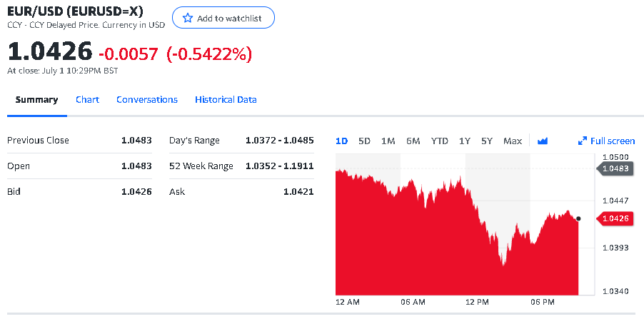
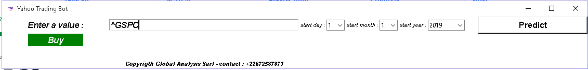
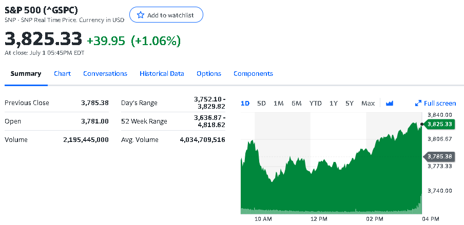

# yahoo-finance-bot-gui


__Yahoo Finance Bot : A tool that predict the dayly tendance of a market (Sell VS Buy) on the basis of Exponential Mooving Average, MACD and RSI.__

### Buy Me A Coffe

__Perfect Money : U289663800__
__BTC : bc1qxm4e7fr0w9vv73qn4lmnxp4u5ekgndxx33trhk__

### 💡 Prerequisites

[python3.x](https://www.python.org/)

### 🛠️ Setup

```
git clone https://github.com/somkietacode/yahoo-finance-bot.git
cd yahoo-finance-bot/
pip3 install -r requirements.txt
```

#### realese also avaible for windows : [Win 64](https://github.com/somkietacode/yahoo-finance-bot/releases/download/v2.0.1/YAHOOFINANCEBOT.zip)

### 📈 Usage

```
python3 yahoo-finance-bot-gui.py

```

### Demo


https://user-images.githubusercontent.com/108131461/177058064-a94e5b91-333a-4cfe-9ccb-607f24e37554.mp4







#### Contact info :

__email : s.r.a.ouedraogo@gmail.com__

[whatsapp](https://wa.me/+22672587871)
[facebook](https://www.facebook.com/globalanalysistech)

### 📝 License

[MIT](https://opensource.org/licenses/MIT)
